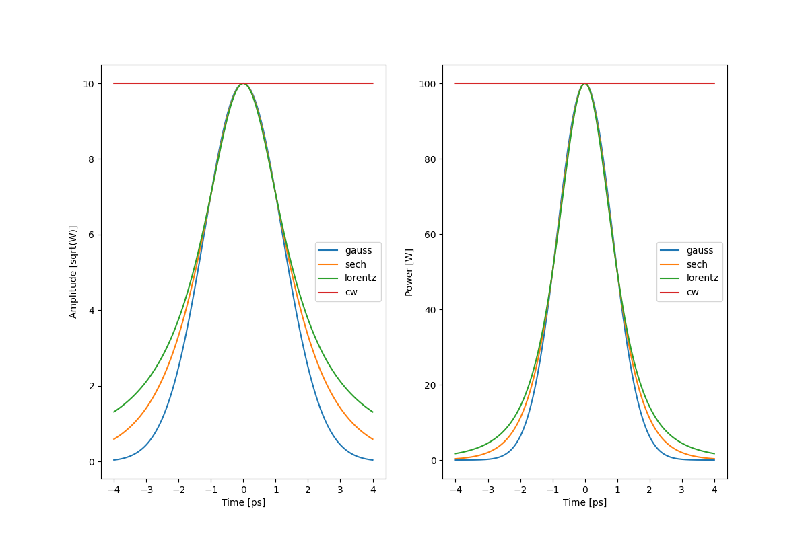

:orphan:

Pulse envelopes
=================

In physics, the envelope of an oscillating signal is a smooth curve
outlining its extremes. The given envelope function is a function of time of
input pulse. The below figure illustrates a modulated waves varying between
an upper and a lower envelope of four types of optical signal.

.. autoclass:: gnlse.SechEnvelope
.. autoclass:: gnlse.GaussianEnvelope
.. autoclass:: gnlse.LorentzianEnvelope
.. autoclass:: gnlse.CWEnvelope
