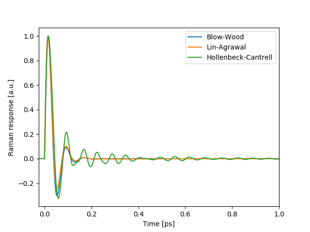

:orphan:

Raman responses
===============

Calculates different Raman responses :math:`R(T)`, based on the chosen Raman
model, the response is calculated. There are three available Raman reponse
models for silica optical fibers:
based on K. J. Blow and D. Wood model [BW89]_,
based on Dawn Hollenbeck and Cyrus D. Cantrell model [HC02]_,
and based on Q. Lin and Govind P. Agrawal model [LA06]_.

The below figure illustrates a various Raman response functions in time
domain.

.. autofunction:: gnlse.raman_blowwood
.. autofunction:: gnlse.raman_holltrell
.. autofunction:: gnlse.raman_linagrawal
